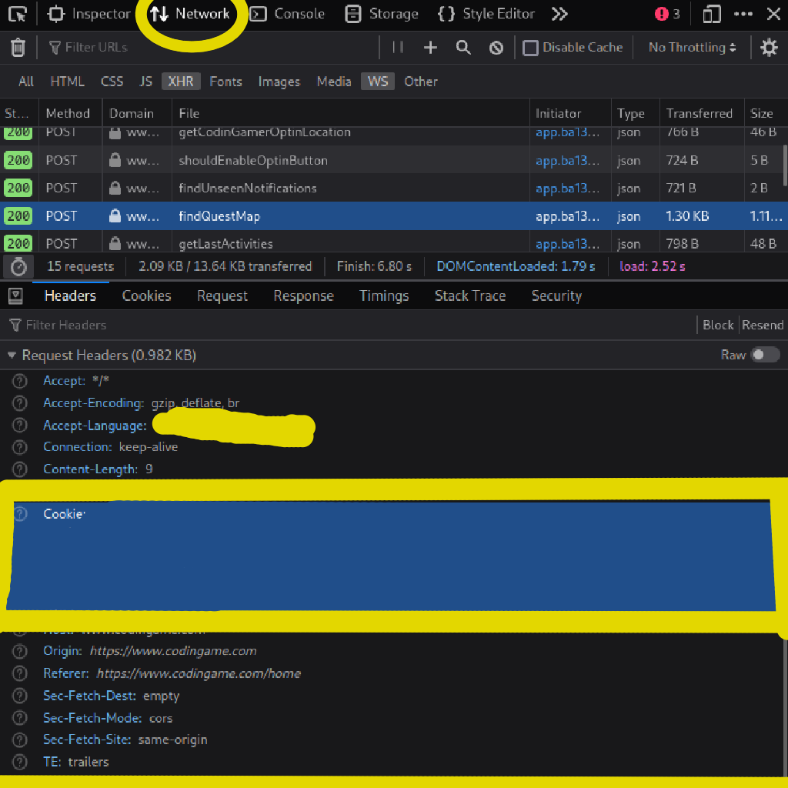
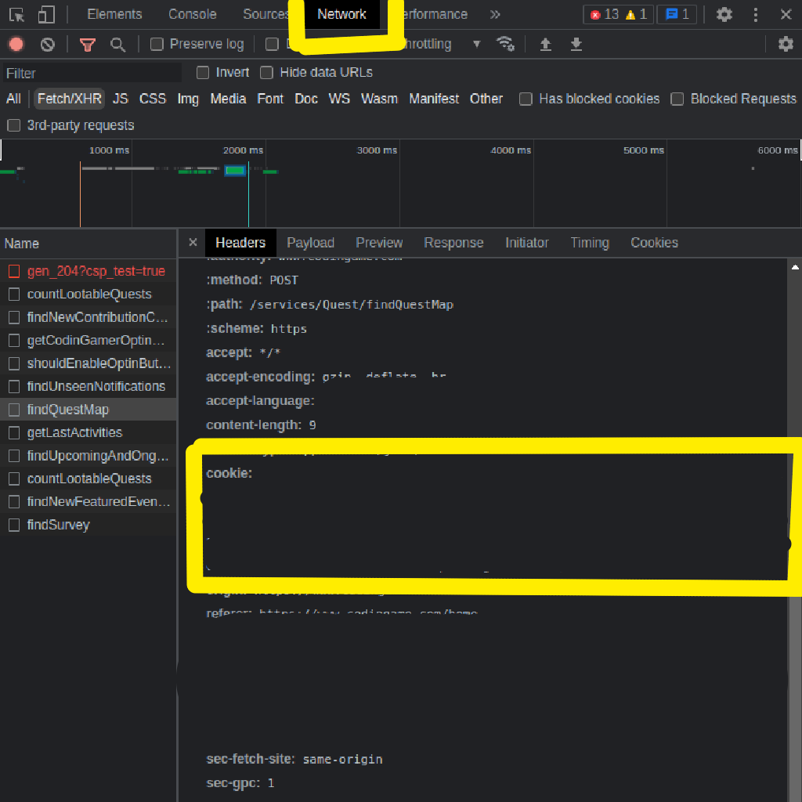

# <p style='text-align: center; margin: 0; padding: 0'>CustomCodinGameClient</p>

This codingame client is not fully replaceable by the original codingame client.
It is, for the moment, complementary to the original website.

Here is what this client adds:

- A shorter version of python for fastest and reverse. This modified version of python, modifies the AST of your original code to add, transform some built-in classes like int, list or str into an extended version of these classes.
- A way to test the code locally (without hidden test cases) by simply pressing a key, [RSHIFT] (by default). As well as a way to submit the code to the server by pressing a key [RCTRL] (by default) 
- A way to automatically receive the problem you are facing with a more sober HTML and a more basic display, which always shows the test cases you missed first.
  

## How does it work?
### Shorter python
As said before, there is a "modified" version of python in this client. But what makes it useful, is that it's also written in python and therefore it's possible to translate the code of the modified version of the code, to a real python code. 

All that logic is made in `translate_ast.py`.

In this shorter python there is also some new built-ins functions and some operators have new meanings.

For example `0@10` is the same as `range(0,10)`. (Operators overloading in python are annoying, so I wasn't able to overload `:` for example.)

- In `prog.py` it's the program that you write
- In `classes.py` is everything related to the modified classes.
- In `default_values.py` there are a lot of built-ins default_values.
- In `functions.py` there is everything related to the functions.
- In `translate_ast.py` the program modifies the AST of prog.py, default_values.py and functions.py. After that, it merges all of them, and add classes.py at the top, with some extra text. And now... the program is a valid python program!
- In `./test/*` there are all the files that tests a function. You can run all the tests with `./test_all.sh`
  
If you don't want to read all the code, you can read `documentation.md` that explain all the new features of this Python superset.

## Installation
The installation isn't the easiest part.
There are a lot of things to do for that client to work.

### Docker
To test the code locally, you will have to install docker, to run the programs in a new environment that is always the same.

Debian:
```sh
sudo apt install docker-ce docker-ce-cli containerd.io docker-buildx-plugin docker-compose-plugin
```

Arch:
```sh
sudo pacman -S docker
```

Gentoo:
```sh
sudo emerge -av app-emulation/docker
```

After that, you will need to build the Dockerfiles.
In `./Docker` there is a `build.sh` program.
You can just do `./Docker/build.sh <lang>` with lang being python or ruby.

### Python libraries
You will also have to install libraries for the programs to work.
All the required librairies are in REQUIREMENTS.txt.
You can install them with
```sh
pip install -r REQUIREMENTS.txt
```

### Cookies and .env
Now, you will need to get the cookie of your account.
To do so, you can `Ctrl + Shift + I`, go on Network, click on almost any XHR request, and in Request Headers, you should see the raw cookies.


<div style="width: 100%;">
    
    
</div>

Copy them. This is what authenticate you. So don't share them to anyone else.

After that you copied them, create a `.env` file that follows the same syntax as `template.env` and in `COOKIE`, paste the cookie.

Last thing that you need to do, is to get the ID of your account.
In most request, it's just going to be the first argument of the Payload / Request.
Its in this format: 1234567.
In the .env, the ID should be the ID of your account that you just got.


### Proxy
Now the part about intercepting requests.
If the program can know when the clash is launched, it is thanks to a proxy.
For the interception of requests, the tool used is `mitmproxy`, which as its name indicates, is not necessarily made for that, however, it largely does the job.
You can find more informations on how to install it at 
https://mitmproxy.org/

In this program we're going to use the CLI interface with the python API.


For mitmproxy to work, you'll need your browser to listen to the proxy created by mitmproxy.
You can find more information on that here: https://docs.mitmproxy.org/stable/overview-getting-started/

When everything is configured that, as well as the previous steps are done, you can now move on to how to use the program


## Usage

First, you will need to start 2 programs.
- `key.py`. With `python3 key.py`. This program will listen for the key press, and when (r_shit, r_ctrl) are pressed, will automatically (test the code locally, submit it). (Note: if the test in local are all OK and that you are in fastest of reverse, the code will automatically be submitted.)
- `listener.py`. With `mitmproxy -s listener.py`. This will launch a program that will listen to your requests with mitmproxy.
Each time a request comes in, it will execute the `response` function. This function will then see if the response gives any information about the problem.
If it does, then it will get the information about the problem, get the test cases, and open a new window with the problem.

